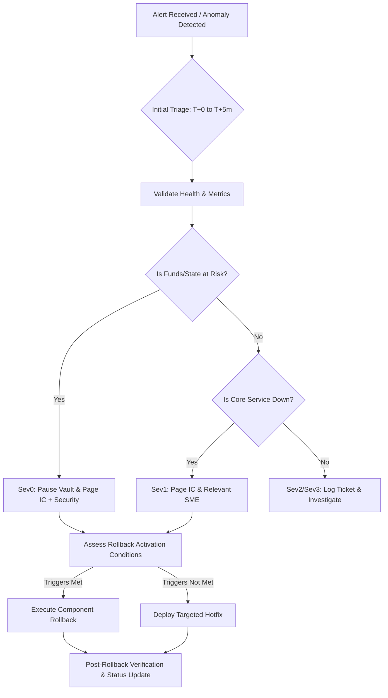

# Incident Response & Rollback Operations Runbook

**Issue:** [#1149](https://github.com/kingksjo/YieldVault-RWA/issues/1149)  
**Purpose:** Operational playbook defining incident triage, escalation protocols, rollback triggers, component-specific rollback procedures, and communication cadences for the YieldVault RWA platform.  
**Audience:** Incident Commanders, On-Call Engineers (Backend, Contracts, Frontend, Platform/DevOps), Security Team  
**Last Updated:** August 2026  

---

## 1. Incident Severity & Operational Ownership

### 1.1 Severity Classification Matrix

| Severity | Definition & Impact | Response SLA | Mitigation Target | War Room Required? |
|---|---|---|---|---|
| **Sev0 (Critical)** | Core functionality unavailable; user funds or vault accounting at risk; active security breach; critical data loss exceeding 15m RPO. | **≤ 5 min** | Immediate / All hands | Yes (`#yieldvault-war-room`) |
| **Sev1 (High)** | Core feature degraded (e.g. deposits failing, RPC degraded >20%, P95 >5x SLO); circuit breaker open; transaction delivery stall. | **≤ 15 min** | ≤ 60 min | Yes (`#yieldvault-incidents`) |
| **Sev2 (Medium)** | Non-critical feature broken (e.g. analytics chart blank, export failure); minor latency elevation; single wallet impact with workaround. | **≤ 1 hour** | ≤ 4 business hours | No (threaded discussion) |
| **Sev3 (Low)** | Cosmetic UI glitch; documentation error; flaky non-blocking test; minor non-customer-facing anomaly. | **≤ 1 business day** | Next release cycle | No (GitHub Issue) |

### 1.2 Operational Ownership & Incident Team Roles

| Role | Primary Responsibilities | Current Escalation Path |
|---|---|---|
| **Incident Commander (IC)** | Leads incident lifecycle, declares severity, coordinates communications, authorizes rollbacks or emergency pauses. | PagerDuty: `YieldVault IC` |
| **Smart Contracts Lead** | Diagnoses on-chain invariants, executes emergency pause, coordinates WASM hash rollbacks or contract upgrades. | `#contracts-oncall` |
| **Backend Lead** | Triages API errors, analyzes database logs, executes service rollback and down-migrations. | `#backend-oncall` |
| **Frontend Lead** | Diagnoses client runtime errors, wallet connection regressions, triggers edge/Vercel rollbacks. | `#frontend-oncall` |
| **DevOps / Platform Lead** | Manages RPC failovers, load balancers, database snapshots/PITR, container rollbacks. | `#platform-oncall` |
| **Security Lead** | Assesses exploit vectors, coordinates key rotations, verifies integrity during breaches. | PagerDuty: `YieldVault Security` |
| **Comms / Support Lead** | Posts public status page updates, coordinates customer success notifications. | `#comms-incident` |

---

## 2. Common Failure Scenarios & Triage Steps



### Scenario A: Smart Contract Accounting Discrepancy / Fund Safety Threat
- **Symptoms**: `total_assets()` or share price deviates from expected formula; deposit/withdraw events revert on-chain; unauthorized asset movement.
- **Immediate Action**:
  1. Incident Commander & Contracts Lead immediately trigger emergency circuit breaker:
     ```bash
     soroban contract invoke \
       --id <VAULT_CONTRACT_ID> \
       --source admin \
       --network <network> \
       -- set_pause --paused true
     ```
  2. Page Security Lead if unauthorized access is suspected.
  3. Freeze indexer and backend ingestion if needed: `SET INDEXER_PAUSED=true`.

### Scenario B: Stellar RPC Provider Failure / Extreme Latency
- **Symptoms**: Horizon/Soroban RPC requests timing out (> 1500 ms); `504 Gateway Timeout` on contract calls; indexer falling behind ledger head.
- **Immediate Action**:
  1. Switch to secondary RPC provider via configuration or load balancer:
     ```bash
     # Update backend environment variable or Consul config
     export STELLAR_RPC_URL="https://backup-rpc.stellar.org"
     systemctl reload yieldvault-backend
     ```
  2. See [`docs/runbooks/RPC_FAILOVER.md`](./RPC_FAILOVER.md) for full failover procedures.

### Scenario C: Transaction Submission & Delivery Failures
- **Symptoms**: Transactions returning `TxFailed`, fee insufficient errors, or stuck in transaction queue.
- **Immediate Action**:
  1. Check network base fee and adjust fee bump multiplier.
  2. Clear stale pending transaction intents from memory/redis queue.
  3. Verify sequence numbers and account sequence synchronization.

### Scenario D: Database Migration Drift / Corruption Post-Deploy
- **Symptoms**: Backend crashing with Prisma schema mismatch; foreign key violation spikes; unrecoverable write errors.
- **Immediate Action**:
  1. Stop incoming API traffic to backend.
  2. Execute migration rollback SQL:
     ```bash
     psql $DATABASE_URL -f backend/prisma/migrations/<target_migration>/rollback.sql
     ```
  3. Revert backend binary/container to previous release commit.

### Scenario E: Frontend Broken Bundle / Chunk Hydration Failures
- **Symptoms**: Blank page on user visits; unhandled JavaScript runtime exceptions in Sentry; CSS/layout corruption.
- **Immediate Action**:
  1. Trigger instant rollback in hosting platform:
     ```bash
     vercel rollback --token $VERCEL_TOKEN
     ```
  2. Purge Cloudflare / CDN edge cache for frontend routes.

---

## 3. Rollback Activation Conditions

The Incident Commander MUST authorize a rollback if any of the following conditions are met:

1. **Unresolved Health Probe Failure**: Backend `/health` or `/ready` failing for > 2 consecutive minutes after deployment.
2. **Critical Error Budget Exhaustion**: HTTP 5xx error rate > 5% on tier-critical API endpoints (`/api/v1/vault/*`, `/api/v1/transactions/*`) for > 5 minutes.
3. **Smart Contract Invariant Violation**: Any state corruption, math inconsistency in share pricing, or failure in deposit/withdraw execution.
4. **Data Integrity Failure**: Database migrations producing data loss or query failures that cannot be fixed within 15 minutes.
5. **Security Vulnerability**: Critical vulnerability discovered in newly deployed code that exposes funds, user data, or API authorization keys.

---

## 4. Step-by-Step Rollback Operations

### 4.1 Smart Contracts Rollback

#### Option 1: WASM Hash Downgrade (In-place contract rollback)
When the contract proxy or upgrade pattern allows WASM replacement:
```bash
# 1. Ensure vault remains paused
soroban contract invoke \
  --id <VAULT_CONTRACT_ID> \
  --source admin \
  --network <mainnet|testnet> \
  -- set_pause --paused true

# 2. Revert to previous known-good WASM hash
soroban contract invoke \
  --id <VAULT_CONTRACT_ID> \
  --source admin \
  --network <mainnet|testnet> \
  -- upgrade --new_wasm_hash <PREVIOUS_STABLE_WASM_HASH>

# 3. Verify contract version and invariant state
soroban contract invoke --id <VAULT_CONTRACT_ID> --network <network> -- version
soroban contract invoke --id <VAULT_CONTRACT_ID> --network <network> -- total_assets

# 4. Unpause once verified
soroban contract invoke \
  --id <VAULT_CONTRACT_ID> \
  --source admin \
  --network <network> \
  -- set_pause --paused false
```

#### Option 2: Fallback Contract Address Re-pointing
If in-place WASM upgrade is damaged:
1. Update `VAULT_CONTRACT_ID` in backend and frontend environment configs to point to the previous immutable contract address.
2. Trigger backend redeploy and frontend CDN redeployment.

### 4.2 Backend Service Rollback

```bash
# 1. Stop active backend process / container
sudo systemctl stop yieldvault-backend

# 2. Checkout previous stable release commit/tag
cd /app/yieldvault-backend
git checkout <PREVIOUS_RELEASE_TAG>

# 3. If database migration was executed, apply down-migration
psql $DATABASE_URL -f prisma/migrations/<FAILED_MIGRATION>/rollback.sql

# 4. Rebuild & start service
npm ci --production
npm run build
sudo systemctl start yieldvault-backend

# 5. Verify local health
curl -f http://localhost:3000/health
curl -f http://localhost:3000/ready
```

### 4.3 Frontend Rollback

```bash
# Vercel Instant Rollback
vercel rollback --token=$VERCEL_TOKEN --yes

# Or re-deploy pre-built previous artifact
vercel deploy --prebuilt --prod --token=$VERCEL_TOKEN

# Clear CDN Edge Caches
curl -X POST "https://api.cloudflare.com/client/v4/zones/$CF_ZONE_ID/purge_cache" \
  -H "Authorization: Bearer $CF_API_TOKEN" \
  -H "Content-Type: application/json" \
  --data '{"purge_everything":true}'
```

### 4.4 Database Disaster Recovery (Point-in-Time Recovery)
If database state was corrupted:
1. Stop backend writers.
2. Initiate Point-in-Time Recovery (PITR) to timestamp `T_deploy - 5 minutes` via AWS RDS / Supabase / GCP Cloud SQL console.
3. Validate row counts and table integrity.
4. Point backend to restored database instance and restart.

---

## 5. Incident Communication Cadence & Status Updates

### 5.1 Update Cadence by Severity

| Severity | Internal Status Frequency | Public Status Page Frequency | Target Channels |
|---|---|---|---|
| **Sev0** | Every 15 minutes | Every 15–30 minutes | `#yieldvault-war-room`, Statuspage.io, PagerDuty |
| **Sev1** | Every 30 minutes | Every 30–60 minutes | `#yieldvault-incidents`, Statuspage.io |
| **Sev2** | Every 1–2 hours | As appropriate | `#yieldvault-incidents` |
| **Sev3** | Upon resolution | Not required | GitHub Issue |

### 5.2 Communication Templates

#### Template: Initial Acknowledgment (T+5 min)
```text
🚨 INCIDENT DECLARED: [Brief summary, e.g. Elevated 5xx error rate on vault deposit route]
Severity: [Sev0 / Sev1 / Sev2]
Incident Commander: @[Name]
Lead Responder: @[Name]
War Room: #yieldvault-war-room (Zoom bridge link)
Status: Investigating root cause. Next update in 15 minutes.
```

#### Template: Rollback In Progress
```text
⚠️ ROLLBACK INITIATED: [Reason for rollback, e.g. Contract version v1.4.0 invariant validation failure]
Scope: Reverting backend to v1.3.9 and contract WASM to hash [hash_prefix]
Authorized By: IC @[Name]
Expected Downtime: 2-5 minutes
Next update: Upon rollback verification.
```

#### Template: Incident Resolved
```text
✅ INCIDENT RESOLVED: [Summary of resolution]
Final Severity: [Sev0 / Sev1 / Sev2]
Impact Window: YYYY-MM-DD HH:MM to HH:MM UTC (Total: XX mins)
Actions Taken: [e.g. Rolled back backend to commit sha, verified health checks, unpaused vault]
Postmortem: Target date YYYY-MM-DD (within 48h) in docs/incidents/
```

---

## 6. Post-Rollback Verification & Sign-Off

Before resolving the incident and reopening public services, verify:

- [ ] `GET /health` returns HTTP 200 `healthy`.
- [ ] `GET /ready` returns HTTP 200 `ready: true`.
- [ ] Vault contract `paused()` is `false` (if deliberately unpaused) and share pricing math is verified.
- [ ] Test deposit and withdrawal executed successfully on staging/mainnet canary account.
- [ ] Sentry error rates returned to pre-incident baseline for > 10 minutes.
- [ ] Public status page marked as **Resolved**.
- [ ] Postmortem issue scheduled (within 48 hours for Sev0/Sev1) per [`docs/postmortem-playbook.md`](../postmortem-playbook.md).
